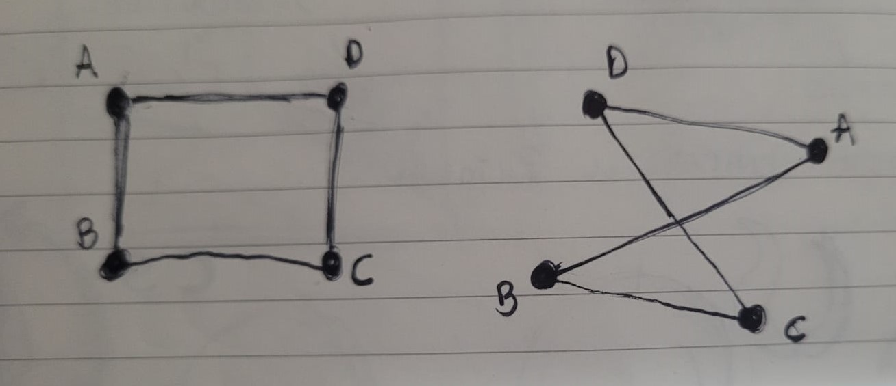
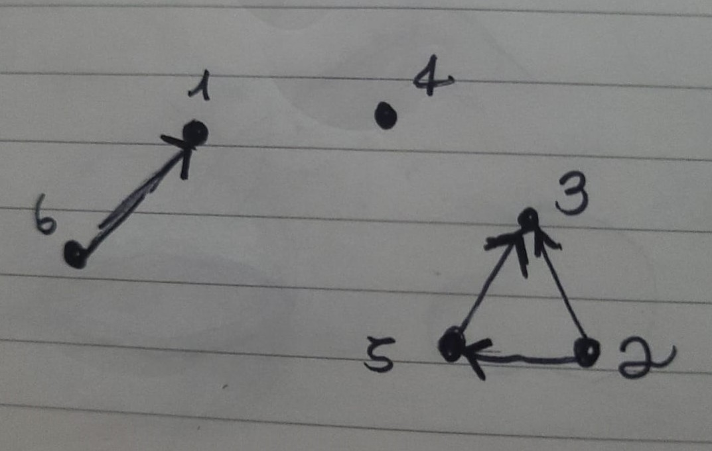

**1** - \
**a)** Um subgrafo de um grafo G é um grafo H tal que todo vértice em H também está em G e toda aresta em H também está em G.\
**b)** Um grafo bipartido é um grafo cujos vértices podem ser divididos em dois conjuntos disjunt os U e V, de modo que cada aresta do grafo conecte um vértice de um conjunto a um vértice do outro conjunto. \
**c)** Um grafo hamiltoniano é um grafo que contém um ciclo hamiltoniano, que é um ciclo que visita cada vértice do grafo exatamente uma vez. \
**d)** É um grafo que contém um ciclo Euleriano, que por sua vez é um ciclo que visita todas as arestas do grafo exatamente uma vez. Um grafo é Euleriano se e somente se todo vértice tem grau par.

**2** - Um algoritmo de busca em largura (Breadth-first search - BFS) é utilizado em grafos para realizar uma busca ou travessia no grafo ou na estrutura de dados do tipo árvore. O algoritimo inicia a busca pelo vértice raiz e explora todos os vértices vizinhos. Partindo do vértice raiz explora-se todos os vértices mais próximos (vizinhos), explora-se os vértices vizinhos inexplorados e assim por diante, até que ele encontre o alvo da busca.

**3** - \
Um grafo completo com n vértices e cada par de vértices distintos é conectado por uma única aresta.

O número de arestas em um grafo não direcionado completo com n vértices é **n(n-1)/2.**

Um grafo direcionado completo tem n vértices e cada par de vértices distintos é conectado por uma única aresta direcionada.

O número de arestas em um grafo direcionado completo com n vértices é **2n(n-1).**

Um grafo direcionado completo com n vértices tem n(n-1) arestas direcionadas, que podem ser interpretadas como 2n(n-1) arestas não direcionadas (uma vez que cada aresta direcionada pode ser convertida em duas arestas não direcionadas em direções opostas). Portanto, um grafo direcionado completo com n vértices possui 2n(n-1) arestas.

**4** - Grafos isomórficos são grafos que possuem a mesma estrutura, o que significa que seus vértices e arestas podem ser renomeados de forma a preservar as relações de adjacência. Formalmente, dois grafos G e H são isomórficos se existe uma bijeção (injetiva e sobre mapeamento) f dos vértices de G aos vértices de H tal que para quaisquer dois vértices u e v em G, u é adjacente para v em G se e somente se f(u) for adjacente a f(v) em H

**5** -

Matriz quadrada de tamanho n = 9
Cada linha/coluna representa o número do node(vértice)
os nós vão de 1 a 9

**Graus**

- node 1: 2
- node 2: 3
- node 3: 5
- node 4: 2
- node 5: 3
- node 6: 1
- node 7: 0
- node 8: 2
- node 9: 1

**Nós isolados**:

- O node 7 é isolado

**6** -

a) Caminho simples do vértice M ao vértice S é o seguinte: M -> S.\
b) Caminho de ciclo envolvendo quatro vértices = N > O > M > S > M \
c) É conectado. \
d)

- N in (indgree) = 1
- N out (outdgree) = 4
- Degree 5

- R in (indgree) = 0
- R out (outdgree) = 2
- Total Degree = 2
   
  e) **Lista de adjacência**
- M: S
- N: O, Q, S, R
- O: M, N
- P: R, M, P
- Q:
- R:
- S: M
   
  f) Matriz de adjacência  
  0, 1, 0, 0, 0, 0, 0,  
  1, 0, 0, 0, 0, 0, 0,  
  0, 1, 0, 1, 0, 1, 1,  
  1, 0, 1, 0, 0, 0, 0,  
  1, 0, 0, 0, 1, 1, 0,  
  0, 0, 0, 0, 0, 0, 0,  
  0, 0, 0, 0, 0, 0, 0,  

**7** -

**8** - \
somatório(graus) = 2 * num de arestas \
(3*3)+5 = 2 _ num de arestas \
14 = 2 _ num de arestas \
num de arestas = 14/2 \
**Resposta:** 7
