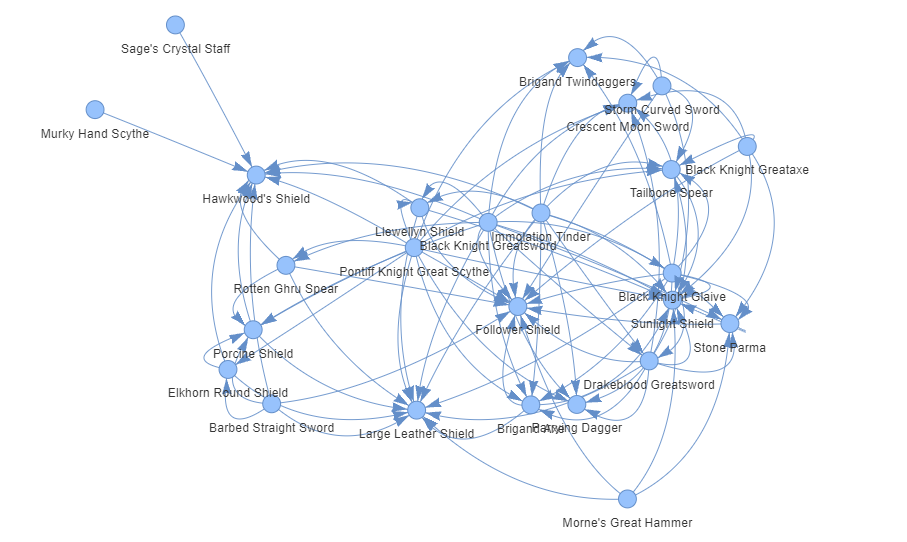

# README.md

## Online Links

- Tutorials: https://colab.research.google.com/drive/1NFWYdI3_lEYGzj3R7QlskMfxdhnkGJXp?usp=sharing

- Project: https://colab.research.google.com/drive/1QM4s-DrzrDGS8c6oVxoCbFgX4Snj-LFN?usp=sharing

- Repo: https://github.com/henrymedeiros/network-analysis-assignments/tree/main/unit-2

## Instructions

- You will need to load the "DS3\*weapon.csv" file to
  the "U2*Atividade_1*(Projeto)" colab file for it to work properly

- You will need to load the "flights.csv" file to
  the "U2*Atividade_1*(Tutoriais)" colab file for it to work properly

## Files

- flights.csv: https://www.kaggle.com/datasets/usdot/flight-delays
